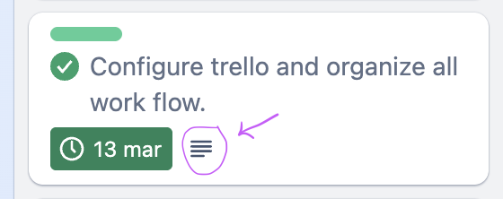
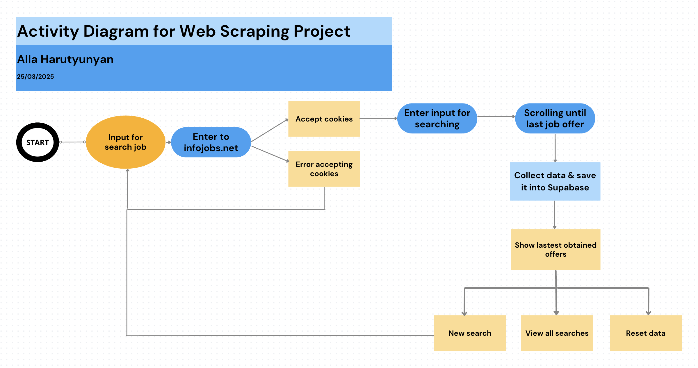

# Proyecto Web Scraping para Factoría F5

En este tercer proyecto de **Factoría F5**, se me pidió realizar un **web scraping** de una página web de mi elección. He decidido hacer scraping en **InfoJobs** para obtener las ofertas de trabajo disponibles según una palabra clave de búsqueda.

### Descripción

El objetivo del proyecto es crear un scraper que recoja las ofertas de trabajo de InfoJobs según un término ingresado por el usuario en un frontend. Los datos clave que se extraen son:

🔹 **Datos clave a obtener**:
- Nombre de la oferta
- Empresa que lo sube
- URL de InfoJobs de la empresa
- Ciudad
- Modalidad
- Salario
- Tipo de contrato
- Tipo de jornada


Para llevar a cabo este proyecto he usado las siguientes herramientas:
- Lenguaje Python
- Librería selenium para scrapear
- Chromedriver para scrapear en Google Chrome, y Geckodriver para scrapear en Firefox
- Supabase.com para base de datos postgres
- Librería logging de Python para la trazabilidad de logs y errores
- Test unitarios para el modelo y para los views, en scraper > tests.py
- Para evitar baneos de IP, he usado user_agent y undetected_chromedriver
- He usado Tailwind para el frontend
- Imagen Docker subido a Docker Hub para poder descargar de forma fácil
- Trello para la organización de mi proyecto
<br>

En este proyecto, he decidido hacer todo en inglés (excepto el README); los nombres de variables, github commits, notas en trello, tabla base de datos, etc.
<br>


> [!NOTE]
>
> En las tarjetas de Trello, puedes ver que hay etiquetas por colores, desde nivel básico hasta nivel avanzado según los requisitios de este proyecto.

> [!NOTE]
> 
> Encontrarás varias ramas en mi repositorio github:
> - **main**: rama principal, actualizado y funcionando
> - **feature/scraping-v1**: rama donde empecé a hacer el código
> - **feature/scraping-v2**: rama de la última versión, donde he ido trabajando y mergeandolo todo en main a medida que funcionaba todo de forma correcta
> - **feature/docker**: rama donde he integrado Docker

## ¿Cómo descargar y probar mi proyecto?

### Paso 1:
Descargar mi repositorio en tu local:<br>
```bash
git clone https://github.com/alharuty/Project-Web-Scraping.git
```

### Paso 2:
Entra en el repositorio:<br>
```bash
cd Project-Web-Scraping
```

### Paso 3: 
Crea un entorno virtual y actívalo:<br>
```bash 
python3 -m venv .venv
```
```bash
source .venv/bin/activate
````

### Paso 4:
Descarga todas las dependencias necesarias:<br>
```bash
pip install -r requirements.txt
```

### Paso 5:
Renombra el archivo .env.example por .env , e inserta los datos que te he dado.

### Paso 6:
Pon en marcha el proyecto:<br>
```bash
python scraper_project/manage.py runserver
```

### Paso 7: 
Entra en http://127.0.0.1:8000/ y realiza tu búsqueda de trabajo.


### URLs disponibles

- **Búsqueda**: [http://127.0.0.1:8000/search](http://127.0.0.1:8000/search) - Realiza una búsqueda con el término que desees.
- **Ofertas**: [http://127.0.0.1:8000/offers](http://127.0.0.1:8000/offers) - Muestra las ofertas de trabajo relacionadas con tu búsqueda o todas las búsquedas realizadas (disponibles en la base de datos).
- **Error**: [http://127.0.0.1:8000/error](http://127.0.0.1:8000/error) - Página de error cuando algo no sale bien.


### Diagrama de actividad



### Demo del proyecto

[Haz click aquí para ver la Demostración](https://www.canva.com/design/DAGijP_bTMA/DbQRFCVzr6SFNPLYF_K7Jw/edit?utm_content=DAGijP_bTMA&utm_campaign=designshare&utm_medium=link2&utm_source=sharebutton)

### Comandos para ejecutar tests unitarios

Para ejecutar los tests unitarios, usa los siguientes comandos:

```bash
python scraper_project/manage.py test scraper.tests.test_models --keepdb
```
```bash
python scraper_project/manage.py test scraper.tests.test_views --keepdb
```

Se usa ``--keepdb``para que cada vez que corremos los test no cree una nueva base de datos y así no dar errores.


### Problemas encontrados y soluciones

‼️ **Problemas encontrados**:
1. **Problema con el número de ofertas**: Inicialmente, el scraper solo traía las primeras 5 ofertas, aunque la página mostraba 23. La solución fue calcular la altura del contenedor de una oferta de trabajo y realizar un scroll lento usando esa altura multiplicada por 4 (la cantidad que se ve por defecto por pantalla).
   
2. **Detección de automatización**: Al usar Mozilla Firefox, InfoJobs detectó que estaba utilizando Selenium, por lo que decidí cambiar a Chrome con las dependencias `user_agent` y `undetected_chromedriver` para evitar la detección.

3. **Modal de cookies**: El script se detenía si no aceptaba el modal de cookies manualmente. Gracias a una compañera, entendí que también podía automatizar ese 'click' para aceptar las cookies.

4. **Dockerización**: Al intentar dockerizar el proyecto con Chrome, encontré algunos errores. Por eso, opté por dockerizar la versión con Firefox utilizando el argumento `--headless`, pero debido a que InfoJobs detecta el scraping en Firefox, mi imagen no puede realizar búsquedas, solo muestra el historial de búsquedas anteriores en caso de que exista.

### Próximas mejoras

- Actualmente no puedo obtener la página web de la empresa, solo la URL de InfoJobs. Mi plan es crear una nueva tabla que conecte con el ID de la empresa, entrar a la url de Infojobs de la empresa, extraer su página web principal mediante otro **view** nuevo, y mostrarla en el frontend en formato HTML.
- Añadir filtros en la página offers, para que el usuario pueda filtrar por salario, por ciudad, etc.
- Añadir gráfico que muestre una media de salarios.
- Structura POO.
- Automatizar script con Cronjob.
- Traducir el README a inglés.
- Scrapear las paginas >1.
<br>

> [!NOTE]
>
> Tuve un pequeño problema con Github, ya que dentro de mi repositorio local creé sin querer otro repositorio, lo que me generaba conflictos a la hora de hacer commits. Finalmente, pude borrar y desvincular el repositorio local y creé una nueva rama `feature/scraping-v2` para continuar trabajando.


> [!NOTE]
>
> Es cierto que el la imagen de mi Docker no funciona correctamente para hacer búsquedas, pero como sí que devuelve la lista de las anteriores búsquedas desde la base de datos, he querido dejarlo subido para mostrar que he podido subirlo, y posteriormente podré corregir el error.

[Link a la imágen de Docker](https://hub.docker.com/r/allaharuty/scraper-v2)

## ¿Cómo descargar y usar mi imagen desde Docker Hub?

Para poder ejecutar este proyecto mediante Docker, sigue estos pasos:

- Asegúrate de tener instalado **Docker** en tu máquina. Si no lo tienes, puedes descargarlo e instalarlo desde [aquí](https://www.docker.com/get-started).

- Además, abre **Docker Desktop** y asegúrate de que Docker esté en ejecución.

### Descargar la imagen de Docker
Para descargar la imagen del proyecto desde Docker Hub, abre tu terminal y ejecuta el siguiente comando:

```bash
docker pull allaharuty/scraper-v2:latest
```

### Ejecutar el contenedor:
Una vez descargada la imagen, puedes ejecutar el contenedor con el siguiente comando:

```bash
docker run -d --name scraper-v2 allaharuty/scraper-v2:latest
```

### Verificar el funcionamiento:
Para comprobar que el contenedor se está ejecutando correctamente, puedes ver los logs con el siguiente comando:
```bash
docker logs scraper-v2
```

### Detener después de usar:
Cuando hayas terminado de usarlo, puedes detener el contenedor con:
```bash
docker stop scraper-v2
```

### Eliminar después de detener:
Y si deseas eliminar el contenedor después de detenerlo, ejecuta:
```bash
docker rm scraper-v2
```
